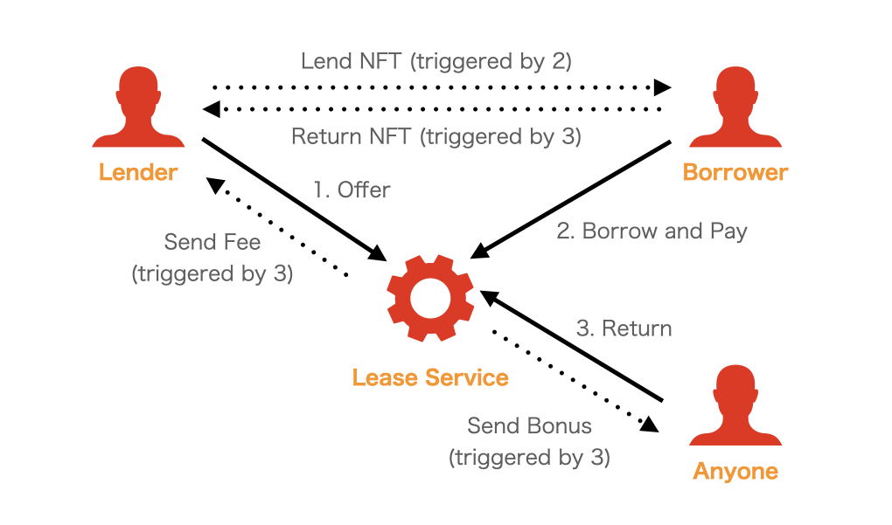

# NFTRental

## プロジェクト概要

NFTRentalは、
大きな資金負担や流動性リスクを負うことなくNFT保有者限定の体験やサービスを一時的に得たいというCrypto資産や体験の乏しいユーザが、
小さな資金負担でもコミュニティに参加できるようするリースサービスです。

より多くの人がCryptoのコミュニティやサービスを体感できるきっかけを提供しRabbit Holeの入口となります。

RentaFiにおけるwrapped NFTの発行やEIP4907を活用したサービスと違って、既存のBlue-Chip NFTに対して直接利用できる拡張性・後方互換性が備わっています。

## サービス設計

### 概要

GameFiにおけるスカラーシップなどNFTの貸し出しは既に多く行われておりニーズの高い取引と言えます。しかし、コントラクトによる自動執行がなされていない信用の上に成り立っている取引の存在やデファクトスタンダードとなる規格がないことなど課題が多いです。

NFTRentalはそうした課題を解決します。



**担保なしのトラストレスな一時保有**  
コントラクトウォレットを活用することで転売されるリスクを回避した上でNFTの所有を一時的に貸し出すことができます。

**既存NFTにおける活用**  
また、NFTコントラクトの実装による解決では、後方互換性がなくサービス側も特別な対応を行う必要があります。BAYCなど既存のコミュニティの体験価値が高いNFTに対して、一時的な貸し出しを行えることがNFTRentalの大きな特徴です。

**分散化された運営**  
サービスを維持するインセンティブを外部に提供し、運営によって提供されるべき維持管理機能を最小化します。
具体的に、NFT返却時に手数料以上の還元を行うことで、第三者によって自動でNFTが返却されるように開発されています。

### 補足

[Appendix](./design/appendix.md)

[シーケンス](./design/sequenceDiagram.md)

## 技術仕様など

### 使用したtech stacks 

**frontend**  
- 開発言語：Dart
- FW、パッケージ：Flutter

**contract**  
- 開発言語：Solidity, TypeScript
- FW、パッケージ：Hardhat, OpenZeppelin

### 使用したBlockchain 

[Ethereum Görli Testnet](https://goerli.net)

### 前提となるEIP

- [EIP721](https://eips.ethereum.org/EIPS/eip-721)  
  対応するNFTの規格。現状1155など他規格には対応していない。
- [EIP1271](https://eips.ethereum.org/EIPS/eip-1271)  
  コントラクトウォレットがEOAの署名を検証するインターフェースの標準。Finalize済みであり、Openseaはじめアプリの対応が進みつつある。EIP1271に対応したVaultに借りたNFTを保管することによって、ownerであることを証明できるがtransferできないという状態にすることができる。
### Contract

[LeaseService (Etherscan)](https://goerli.etherscan.io/address/0xE45D10bae4Aa5C9a8C9016A39dD899485D9deac3)

[LeaseVault (Etherscan)](https://goerli.etherscan.io/address/0xF0550c4e121f18E3d8181371BE011178D2eeA4dF)

[ドキュメント_gas代の試算](./design/contract.md)

[実装_インターフェース](./contract-dev-env/contracts/ILeaseService.sol)

### Application Code

[frontend](./nft_lending_page/)

[contract](./contract-dev-env/contracts)

### Test手順

#### Contract

```
cd contract-dev-env
npm ci
npx hardhat test
```

### Projectアクセス

[Web Application](https://tokyo-web3-hackathon-team.github.io/nft-rental/)

[Demo](https://www.loom.com/share/60a3f4d380824dc3be7e6694d15ddfbf)