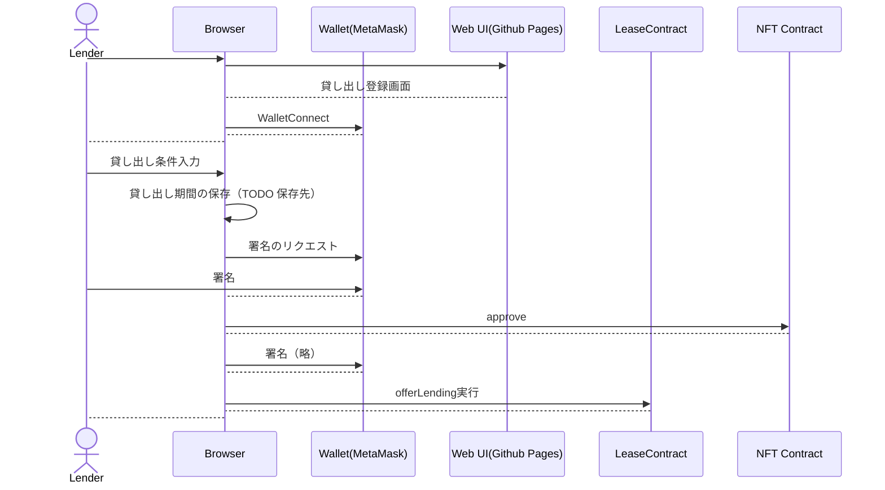
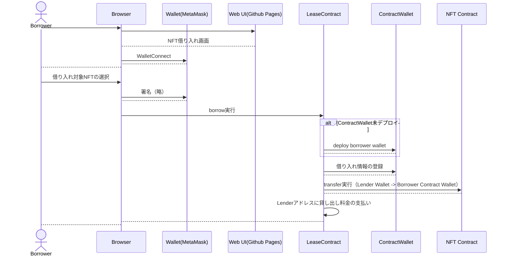
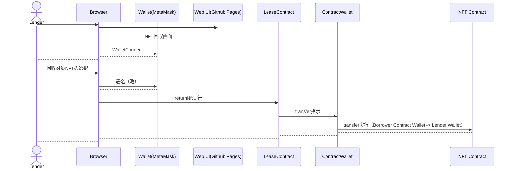

## 処理シーケンス

### NFT 貸し出し申請

### NFT 借り入れ

### 貸し出した NFT の回収

### Lease Contract 概要

#### ファイル名： LeaseService.sol

#### メソッド一覧

- offerLending

  - input
    - lendingAddress: address（貸し出し対象 NFT のスマコンアドレスアドレス）
    - tokenId: uint256
    - price: uint256（貸し出し金額）
  - output
    - なし
  - バリデーション
    - msg.sender のアドレスが input の NFT を保有していない場合、エラー

- borrow
  - input
    - borrowAddress: address（借り入れ対象 NFT のスマコンアドレス）
    - tokenId: uint256
  - output
    - なし
  - バリデーション
    - msg.sender のあアドレスが借り入れ金額を保有していない場合、エラー
    - offerLending で登録した貸し出し者のアドレスが NFT を保有していない場合、エラー
  - returnNft
    - input
      - returnAddress: address（返却対象 NFT のスマコンアドレス）
      - tokenId: uint256
    - output
      - なし
    - バリデーション
      - 対象の NFT が借り入れ済み NFT でない場合、エラー
